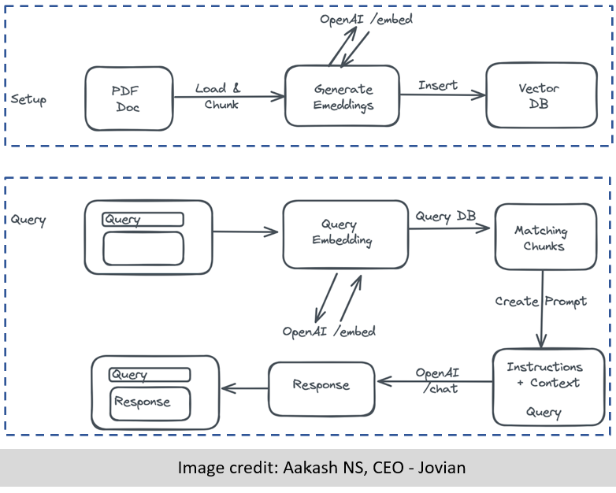

# NanoBot-Dev Documentation 🤖

Welcome to the NanoBot-Dev documentation. This site provides comprehensive information about using and extending the NanoBot development pipeline.

## What is NanoBot?

NanoBot is a GenAI powered document processing and retrieval system with vector search capabilities. It allows you to:

- Process documents (PDF, DOCX, TXT, Google Sheets etc)
- Chunk documents into manageable pieces
- Generate vector embeddings
- Store the document data and text in a relational database
- Search documents via a simple chatbot interface

## Purpose of this development codebase

We are developing a codebase that creates an intuitive pipeline that can be easily followed, understood and modified by all members involved in the development. The Dev component is a robust pipeline that can empower people and organizations to generate their very own Bot with their own documentation, enabling them to also demonstrate and understand the power and potential of GenAI in their own labs, facilities and research.

This project presumes that an out-of-the-box chatbot developed using many online WYSIWYG frameworks is great for concept, but often fails on utility. By introducing and teaching these concepts in a python codebase framework, we open up the power of Generative AI with only a few customizations.  

It is our hope by doing so, that we not only create a cohesive codebase with functional code for our respective facilities, but that we are able to bring new members on board to help them employ instances of this codebase at their own locations. This building of code simultaneously builds community and further collaboration — this is $\mathbf{C}^3$

## Our Current Selections for Infrastructure

> As of 4/20/2025

The current codebase aims to simplify some of the initial setup and modification of the basic steps of an application.  We have some boilerplate code that organized the steps of a RAG (Retrieval Augmented Generation) Generative AI system, and that has consolidated areas of code where one can modify the parameters of each module, simplyfying the use of the codebase.

### Python as our Language

Pyuthon is the standard language for most Generative AI applications, and is particullary easy to use. This module require `Python 3.12` or above.  

### Document parsing and chunking

We are currently using IBM's [Docling](https://docling-project.github.io/docling/) which can be used to convert most general document formats (and even websites) into a format readable and usable to most Generative AI models.  In particular it is especially good at PDFs, and creates a Docling Document that seperatly identifies and extracts text, tables, pictures, document hierarchy with headers, sections and groups, and understands the content within the context of the page.  

To start, we are extracting all the text and table and the provenance information (such as pages number, file name, and heading the information is part of)

### Database

We currently are using [Neon.tech](https://neon.tech) for our Postgres database.  Postgres is an optimal solution at this early stage as postgres allows, via the [pgvector plugin](https://github.com/pgvector/pgvector-python), semantic similarity searches by vector arithmetic.  

This choice to use [Neon.Tech]() provides a web based solution, using the power of postgres and takes advantage of Neon's capability for data versioning and branching.

### Prompts with Jinja Templates

In this structure, we separate out the prompts for each call to the GenAI model so as to extract this from the working code, to make it more transparent, and to be able to easily modify the prompt for testing.

The prompts are formatted and delivered to the model using Jinja templates, which also allows us to separate the functionality from the other Python code as well.  

### Choice of Generative AI Models

At this point we are using OpenAI for all aspects of our GenAI needs.  This includes using `4o` for the cleaning and formatting of the documents, the embedding of the vectors using , and `4o` for the chat completion steps.  

This choice is currently determined by the quality and output of the model, and the ease of interacting with the API.  

## Quick Navigation

- [Getting Started](getting-started.md) - Installation and basic setup
- [User Guide](user-guide/00-index-user-guide.md) - Detailed usage instructions
- [API Reference](api/database.md) - Technical reference for developers
- [Examples](examples.md) - Code examples and tutorials

